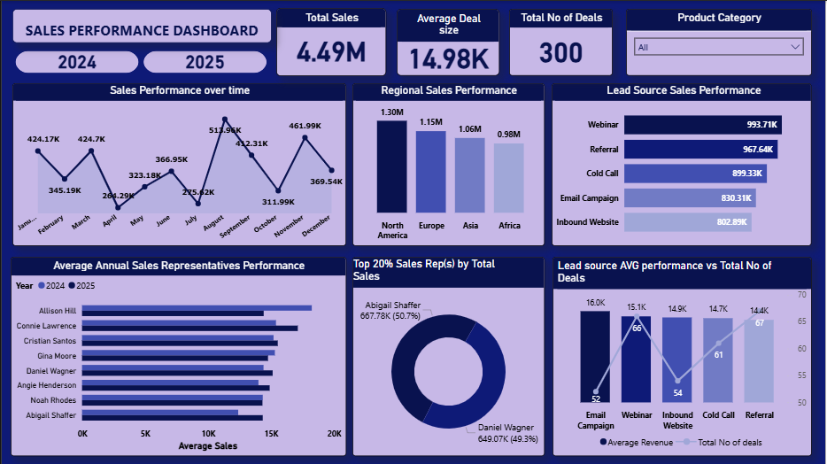

# A SALES AND MARKETING PERFORMANCE DASHBOARD

## 🌟 PROJECT OVERVIEW
This project transforms raw Sales & Marketing data into a clear, interactive dashboard designed to help business leaders understand how revenue is generated, where growth is coming from, and which levers drive performance.

## 🎯 Stake Holder Requirements Adressed

### 1. Sales Performance
-  Total revenue over time (monthly, quarterly, yearly)?
-  Top performing sales representatives?
-  Best performing regions?
-  Average deal size?
-  Top 20% reps by total revenue?
-  Average annual revenue per representative?
### 2. Lead Source Effectiveness
-  Which lead sources drive the most revenue?
-  Whether some sources bring high-value deals?
-  Relationship between number of deals vs value generated?
### 3. Sales Performance Forecast for the next 6 months
-  A forecast showing projected sales performance for the next 6 months

## 📊 Dataset Overview
The dataset includes Sales & Marketing activity with:
- **Customer Details** — ID, Name
- **Sales Representatives** — Names
- **Regions** — North America, Europe, Asia, Africa
- **Products** — Analytics Pro, BI Booster, DataViz Suite, RevOps Tracker
- **Lead Sources** — Webinar, Referral, Cold Call, Email Campaign, Inbound Website
- **Deal Size** — Revenue per sale
- **Deal Dates** — Transaction timing

This enabled multi-dimensional analysis of people, channels, products, and territories.

## 🛠️ Technical Approach
This project uses:
- **Power BI** for dashboard creation
- **DAX Measures, including:** (Total Revenue, Average Deal Size, Count of Deals, Yearly & Quarterly performance metrics)
- **Forecasting visual** for time-series prediction
-  **Slicers/Filters** for interactivity (Year, Product Category, Lead Source, Rep)
-  Clean, user-centered layout with intuitive navigation

## 📷 Dashboard Preview
Dashboard

## 🎥 Walkthrough Video
A 5-minute stakeholder walkthrough explaining:
- How to navigate the dashboard
- Key findings
- Business implications & recommendations

